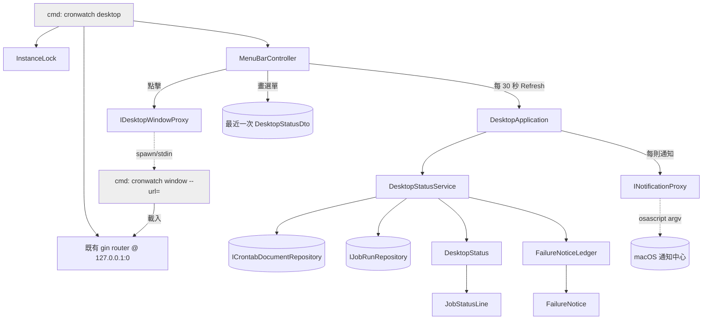

# 桌面常駐應用 — Architecture Design

**Status:** Confirmed
**Source PRD:** `.sdd/2026-08-08-desktop-menu-bar-app/PRD.md`
**Tech context:** Go 1.26 · Clean/Onion Architecture · 檔案系統持久化 · 無資料庫

---

## 1. Design Goal & Guiding Principle

- **一句話**：讓一個 macOS 選單列外殼能以「一次呼叫」拿到完整的桌面畫面資料與該發的通知，而所有判斷規則都留在可測的領域層，外殼本身薄到不需要測試。
- **Guiding principle**：**把平台隔離在最外圈，把規則集中在最內圈。** 選單列與獨立視窗是 macOS 專屬且無法單元測試的，因此它們只做兩件事——呼叫 `DesktopApplication.Refresh()`、把回傳的資料畫出來。「有沒有事要理」「哪幾筆是新的失敗」「摘要怎麼排怎麼截斷」全部在 `DesktopStatusService` 與兩個 entity 裡，與 macOS 無關，也因此 26 個測試案例中沒有一個需要啟動 GUI。

---

## 2. Change Scope

| Area | Action | What / Why |
|:---|:---|:---|
| `internal/domain/entity/` | **Add** | `DesktopStatus`（整體狀態歸納）、`FailureNoticeLedger`（新失敗判定）、`FailureNotice`（通知內容） |
| `internal/domain/vo/` | **Add** | `JobStatusLine`（摘要單行的不可變資料） |
| `internal/domain/dto/` | **Add** | `DesktopStatusDto`、`JobStatusLineDto`、`FailureNoticeDto`、`DesktopRefreshDto` |
| `internal/domain/service/` | **Add** | `DesktopStatusService` — 一次完成「讀取 → 歸納 → 挑出新失敗」 |
| `internal/domain/interface/` | **Add** | `INotificationProxy`、`IDesktopWindowProxy` |
| `internal/application/` | **Add** | `DesktopApplication` — 送通知、保存快照 |
| `internal/controller/` | **Add** | `MenuBarController`（`_darwin` 實作 + `_other` 明確不支援） |
| `internal/infrastructure/notification/` | **Add** | `NotificationProxy` — 走 `osascript`，文字以 argv 傳遞 |
| `internal/infrastructure/desktop/` | **Add** | `DesktopWindowProxy` — 以子程序承載獨立視窗；`InstanceLock` — 單一實例 |
| `cmd/cronwatch/` | **Modify** | `main.go` 加 `desktop`／`window` 兩個子命令分派；`config.go` 加兩個環境變數與桌面預設值；`dependencies.go` 加 `buildDesktopApplication` 與可取回實際埠號的啟動路徑 |
| `Makefile` | **Modify** | 新增 `start-desktop` target |
| `internal/domain/entity/cron_job.go` | **Modify** | 新增 `DisplayName()` —— 摘要要顯示什麼名字是領域知識，不是外殼的排版細節 |
| **既有 HTTP 路由、模板、四種既有形態** | **Not touched** | 桌面形態不改任何既有行為。完整視窗顯示的就是現有頁面，一行模板都不改 |
| **`CrontabCommandRepository` / `JobRunRepository` 等既有 infra** | **Not touched** | 桌面形態不引入任何新的資料來源——它讀的與 host 形態完全是同一批東西 |
| **Docker 相關檔案** | **Not touched** | GUI 相依以 build tag 隔離在 `_darwin.go`，`GOOS=linux CGO_ENABLED=0` 根本不會編到它們 |

---

## 3. New Classes / Modules

| Name | Kind | Responsibility | Collaborators | Satisfies |
|:---|:---|:---|:---|:---|
| `DesktopStatus` | Entity | 由「全部 job + 各自最近一次執行」歸納出整體指示、摘要行（含排序與截斷）、以及待判定的失敗候選。也承載「讀不到排程表」這個狀態 | `CronJob`、`JobRun` | US-01 全部、US-02 全部、US-06 之三 |
| `FailureNoticeLedger` | Entity | 記住「已結算過的執行」，據此判斷哪幾筆失敗是**新出現**的。首次結算只記錄不通知 | `DesktopStatus`、`FailureNotice` | US-03 全部 |
| `FailureNotice` | Entity | 一則待發通知：知道自己該有的標題與內文（含「執行失敗」與「逾時中止」的區別） | — | US-03 之一、之四 |
| `JobStatusLine` | VO | 摘要單行的不可變資料：名稱、排程說明、下次執行、結果、是否需要注意、是否停用 | — | US-02 全部 |
| `DesktopStatusService` | Domain Service | **唯一入口**：`RefreshDesktopStatus(now)` 讀 crontab 與執行紀錄、建 `DesktopStatus`、與 ledger 對帳，回傳「畫面資料 + 該發的通知」 | `ICrontabDocumentRepository`、`IJobRunRepository`、`FailureNoticeLedger` | 幾乎全部 |
| `DesktopApplication` | Application | 編排一次刷新：呼叫 service → 逐則送出通知 → 保存快照供選單即時讀取 | `DesktopStatusService`、`INotificationProxy`、`IClock` | US-03、US-02 之五 |
| `INotificationProxy` | Interface | `Notify(title, body) error` —— 只負責「送出一則通知」，不知道什麼算失敗 | — | US-03 |
| `IDesktopWindowProxy` | Interface | `Open(targetURL) error` / `Close()` —— 開啟或帶到最前，呼叫方不必知道視窗是不是已經開著 | — | US-04 之五 |
| `NotificationProxy` | Proxy (infra) | 以 `osascript` 發系統通知，**文字經 argv 傳入 AppleScript，不做任何字串拼接** | `os/exec` | US-03 |
| `DesktopWindowProxy` | Proxy (infra) | 以「同一個執行檔的 `window` 子程序」承載獨立視窗；已開著時改為送出新網址並把它帶到最前 | `os/exec` | US-04 之五 |
| `InstanceLock` | Infra util | 以檔案鎖保證同一台機器只有一個桌面應用進駐選單列；程序死掉即自動釋放 | `syscall.Flock` | US-05 之四 |
| `MenuBarController` | Controller | 選單列生命週期、輪詢節奏、把 `DesktopStatusDto` 畫成選單、把點擊轉成開視窗 | `DesktopApplication`、`IDesktopWindowProxy` | US-01、US-02、US-04 之五 |

### 為什麼 `RefreshDesktopStatus` 是一個方法而不是三個

淺介面的寫法會是：`ListJobs()` → `ListLatestRuns()` → `ComputeIndicator()` → `DiffFailures()`，由呼叫方依序串起來。那會把「先讀 crontab 再讀執行紀錄、讀失敗時不要對帳、對帳要在建立摘要之後」這串順序知識推給每一個呼叫方，而它們是最不該知道這些的地方（一個 GUI 外殼）。

一次呼叫回傳 `DesktopRefreshDto{ Status, NewFailureNotices }`，讓外殼不可能把順序做錯。

### `RefreshDesktopStatus` 不回傳 error

讀不到排程表在這個用例裡**不是例外，是一種業務狀態**（PRD BR-1 的 `unavailable`）。若簽章帶 error，外殼就有兩條路可以走，而其中一條（忽略 error 顯示空清單）正是 PRD 明確禁止的行為。因此簽章是：

```go
func (service *DesktopStatusService) RefreshDesktopStatus(now time.Time) dto.DesktopRefreshDto
```

失敗原因放在 `Status.UnavailableReason`。**這是本專案唯一一個刻意不回傳 error 的 domain service 方法**，理由如上，勿比照套用到其他 service。

### `DesktopStatusService` 是有狀態的

它持有一個 `*entity.FailureNoticeLedger`。這是全專案唯一有狀態的 domain service，因為「哪些失敗已經通知過」本質上是一段跨呼叫的記憶，而它必須留在領域層（application 不得碰 entity）。一個 service 實例對應一次桌面應用的執行期間；重啟即重新 prime，這正是 PRD「離線期間的失敗不補通知」要的語意。

### `FailureNoticeLedger` 的對帳規則

```
Reconcile(status) []*FailureNotice
  settledNow := status 中「已結束」的最近一次執行的 RunID 集合
  若 primed == false:
      settled = settledNow;  primed = true;  return nil       ← 首次只記錄，不通知
  notices := status.FailureCandidates() 中 RunID ∉ settled 者
  settled = settledNow                                        ← 整份取代，集合大小恆 ≤ job 數
  return notices
```

三個關鍵性質：

- **執行中的紀錄不進 settled**，所以它之後結束成失敗時仍會被通知（DM-24）。
- **settled 每次整份取代**而非累加，集合大小恆等於「有已完成紀錄的 job 數」，不會無限成長。
- **讀取失敗的那一輪根本不呼叫 `Reconcile`**，ledger 原封不動 → 恢復後新出現的失敗仍會被通知（DM-25、DM-26）。

---

## 4. Modified Components

| Component | Current role | Change needed |
|:---|:---|:---|
| `cmd/cronwatch/main.go` | 分派 `serve`／`run` | 加 `desktop`（選單列）與 `window`（視窗子程序）兩個分派；usage 同步更新 |
| `cmd/cronwatch/config.go` | 讀環境變數 | 新增 `DESKTOP_REFRESH_INTERVAL_SECONDS`（預設 30，下界 5）與 `DESKTOP_SUMMARY_LINE_LIMIT`（預設 20，下界 1）；新增 `applyDesktopDefaults`，在桌面形態下強制 `CrontabSource=crontabCommand`、監聽位址改為 `127.0.0.1:0`，並把未明確設定的狀態路徑指向 `$HOME/.local/state/crontab-watcher` |
| `cmd/cronwatch/dependencies.go` | 手動 DI 與路由註冊 | 新增 `buildDesktopApplication`；把「啟動 HTTP 服務」抽成可回傳實際監聽埠號的形式（`net.Listen` 後 `http.Serve`），供桌面形態組出視窗網址 |
| `internal/domain/entity/cron_job.go` | 排程條目 | 新增 `DisplayName()`：有說明用說明，否則用指令（過長時截斷）。摘要要顯示什麼名字是領域知識 |
| `Makefile` | 啟動入口 | 新增 `start-desktop`（先 `build`，用 `bin/cronwatch` 而非 `go run`——理由與 `start-host` 相同：`go run` 的暫存路徑會被寫進 crontab） |

---

## 5. Component Relationships



### 兩個程序，而不是一個

`systray.Run` 與 `webview.Run` **都要求佔用 macOS 的主執行緒與主 run loop**，同一個程序內無法並存。因此獨立視窗以子程序承載：

- 父程序（選單列）：`cronwatch desktop`，主執行緒給 systray。
- 子程序（視窗）：`cronwatch window --url=<url>`，主執行緒給 webview。
- 父 → 子的溝通是**子程序的 stdin，一行一個網址**；子程序把它 `Dispatch` 到 webview 的主執行緒上 `Navigate`。這也就是「視窗已開就帶到最前，不開第二個」的實作（DM-29）：已開著時只送新網址並活化該 PID。
- 額外好處：視窗崩潰不會帶走選單列。

### 服務只綁 loopback 且用臨時埠

桌面形態的 HTTP 服務綁 `127.0.0.1:0`，由系統配一個臨時埠，網址只有選單列自己知道。這同時滿足「其他裝置連不進來」（DM-30）與「不與既有的 8080 打架」。

---

## 6. Extensibility & Handoff Notes

- **最可能的下一個需求**：（a）開機自動啟動、（b）Linux 桌面支援、（c）通知改送到別的地方（Slack、email）。
- **它們會落在哪**：
  - (a) 是純外殼的事——加一個 launch agent plist 的產生器，領域層一行不動。
  - (b) 只需要新增 `menu_bar_controller_linux.go` 與 `window_command_linux.go` 兩個 build-tag 檔。**所有規則已經與平台無關**，`DesktopStatusService` 與兩個 entity 原封不動。
  - (c) 實作另一個 `INotificationProxy` 並在組裝根換掉即可；`DesktopApplication` 不需要知道通知去了哪裡。
- **加法路徑**：新增檔案 + 在 `dependencies.go` 換一行注入，**不需要修改任何既有的 switch 或 if**。
- **套用的模式**：
  - **Adapter**（`INotificationProxy`／`IDesktopWindowProxy`）：把兩個平台細節鎖在介面後面，這是本設計最重要的一條縫，因為平台正是最可能變的軸。
  - **Build tag 分身**（`_darwin` / `_other`）：不支援的平台是**編譯期**就分流，而不是執行期才發現，也讓 Docker 的 `CGO_ENABLED=0` 建置完全不受影響。
- **不要寫死**：輪詢間隔、摘要行數上限、通知文字的組法（在 `FailureNotice` 的 method 上，不要散到外殼）。
- **已知負債／刻意留簡單**：
  - 選單列只讀快照、不強制重新讀取。若哪天需要「點開就是最新的」，在 `MenuBarController` 的展開事件加一次 `Refresh()` 即可，領域層不動。
  - 單一實例用檔案鎖，不做跨程序的訊息傳遞。若哪天需要「第二次啟動時把既有視窗帶到最前」，那才需要一個真正的 IPC 通道——目前只提示「已經有一個在執行中」。

---

## 7. Traceability

| PRD Scenario | Fulfilled by |
|:---|:---|
| US-01 全部納管都成功 / 有失敗 / 逾時 / 只有未納管 / 從未執行 / 讀不到 / 先前失敗但最新成功 | `DesktopStatus.Indicator()` |
| US-02 三種結果並存 / 無從得知 / 空排程表 / 不適用 / 已停用 / 讀不到時的摘要 | `DesktopStatus.Lines(limit)` + `vo.JobStatusLine` |
| US-02 從摘要進入詳情 | `MenuBarController` + `IDesktopWindowProxy` |
| US-03 失敗通知 / 成功不通知 / 未納管不通知 / 逾時有別 / 離線不補 / 連續各一 / 不重複 | `FailureNoticeLedger.Reconcile()` + `FailureNotice` |
| US-03 通知的送出 | `DesktopApplication.Refresh()` → `INotificationProxy` |
| US-04 操作能力一致 / 無輸出可讀 / 不重複觸發 / 外部改動拒寫 | **既有元件，完全不改**——完整視窗載入的就是現有頁面 |
| US-04 視窗已開時帶到最前 | `DesktopWindowProxy.Open()` |
| US-05 看本機真正那份 / 與容器互不影響 | `applyDesktopDefaults` 強制 `CrontabSource=crontabCommand` |
| US-05 其他裝置連不進來 | 監聽 `127.0.0.1:0` |
| US-05 重複啟動 | `InstanceLock` |
| US-06 應用沒開排程照跑 / 結束不影響 / 未納管仍無從得知 | **結構本身**——本服務從不排程，`DesktopStatus` 對 foreign job 恆給 `unknown` |
| DM-32 非 macOS 平台 | `menu_bar_controller_other.go` 回 `ErrDesktopUnsupportedPlatform` |

---

## 8. Risks & Open Decisions

**風險與取捨**

- **新增兩個 CGO 相依**（`energye/systray`、`webview/webview_go`）。選 `energye/systray` 而非更知名的 `getlantern/systray`，是因為後者拖進 17 個模組（含 Windows GUI 的 `lxn/walk` 與一份舊版 testify），前者只多一個 Linux 專用的 `godbus`。兩者都已在本機實測可編譯。**這兩個相依只出現在 `_darwin.go` 檔中**，Docker 的 `GOOS=linux CGO_ENABLED=0` 建置完全不會編到。
- **PRD §6 的「每次確認須在 2 秒內完成，超過即視同取得失敗」**：本設計改以「選單列永遠讀快照、讀取在背景 goroutine 進行」達成其**意圖**（選單列不會卡住），而不加一個逾時。理由：既有 repository 介面沒有 context，硬加逾時只能靠 select + 洩漏的 goroutine，那是用一個真的問題換一個假的保證。慢讀的後果因此只是「畫面舊了幾秒」，不是「畫面卡住」。
- **通知經由 `osascript`**，通知橫幅上的來源會顯示為腳本執行器而非 cronwatch。代價是外觀，換到的是零額外相依。若哪天無法接受，換掉 `INotificationProxy` 的實作即可。
- **`osascript` 帶使用者資料的安全性**：job 名稱來自使用者自己的 crontab，仍**一律以 argv 傳入 AppleScript**（`on run argv` … `item 1 of argv`），絕不字串拼接進腳本。這是專案既有安全紀律的延伸。

**留給實作決定**

- 選單列圖示的三態外觀：以文字符號（`✓`／`!`／`?`）或 template icon 呈現。實作時擇一，要求只有「不能只靠顏色區分」。
- `DisplayName()` 的指令截斷長度：實作時取一個常數即可（建議 40 字元）。
